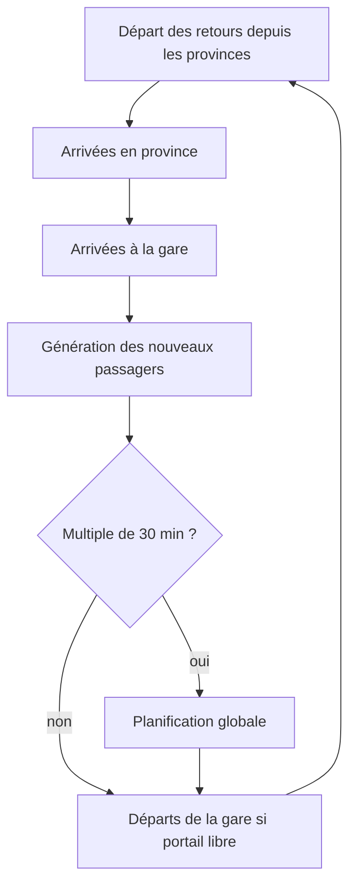
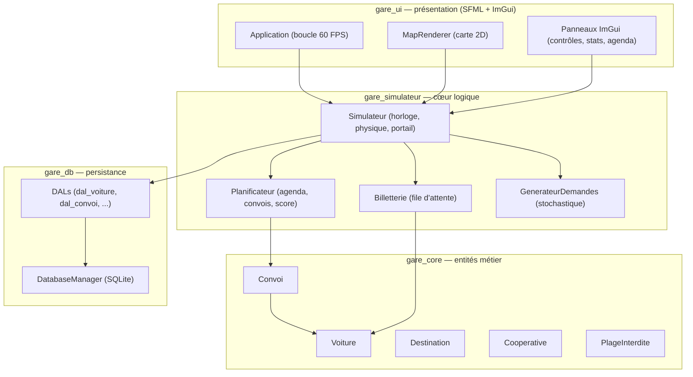
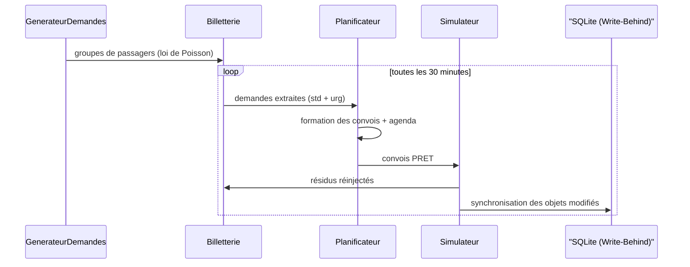
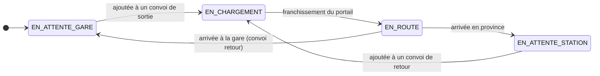
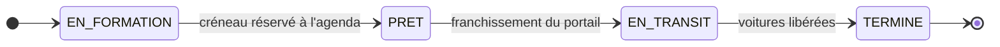
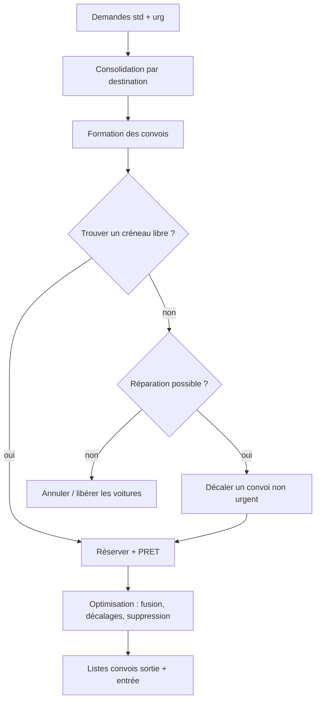

<div align="center">

# 🚌 Gare Routière — Simulateur & Ordonnanceur sous Contraintes

**Un simulateur événementiel discret pour optimiser le trafic d'une gare routière à portail unique.**

C++17 · CMake · SFML 2 · ImGui · SQLite3

[Présentation](#pourquoi-ce-projet) · [Approche](#notre-approche) · [Fonctionnement](#fonctionnement-du-simulateur) · [Architecture](#architecture) · [Algorithmes](#algorithmes) · [Installation](#installation) · [Configuration](#configuration) · [FAQ](#faq)

</div>

---

## 📑 Table des matières

- [Pourquoi ce projet ?](#pourquoi-ce-projet-)
- [Notre approche](#notre-approche)
- [Objectifs](#objectifs)
- [Cas d'utilisation](#cas-dutilisation)
- [Les choix métier expliqués](#les-choix-métier-expliqués)
- [Fonctionnement du simulateur](#fonctionnement-du-simulateur)
- [Fonctionnalités](#fonctionnalités)
- [Architecture](#architecture)
- [Algorithmes](#algorithmes)
- [Installation](#installation)
- [Configuration](#configuration)
- [Performances & optimisations](#performances--optimisations)
- [Tests](#tests)
- [Limites](#limites)
- [Roadmap & évolutions futures](#roadmap--évolutions-futures)
- [FAQ](#faq)
- [Glossaire](#glossaire)
- [Remerciements](#remerciements)
- [Licence](#licence)
- [Conclusion](#conclusion)

---

# Pourquoi ce projet ?

## Un problème bien réel : la gare routière d'Antananarivo

À Madagascar, et particulièrement dans la capitale **Antananarivo**, les gares routières sont une source importante d'embouteillages et de désorganisation.

L'organisation actuelle repose essentiellement sur chaque **coopérative de transport**. Chaque coopérative décide librement de l'heure de départ et de l'heure d'arrivée de ses véhicules. Il n'existe pratiquement **aucune coordination globale** entre elles.

> [!IMPORTANT]
> Il est donc fréquent que plusieurs bus provenant des provinces arrivent simultanément au moment où plusieurs autres bus quittent la gare.

Comme la majorité des gares routières ne disposent que d'un **portail unique**, les flux entrants et sortants se retrouvent en conflit direct. Les conséquences sont connues de tous les usagers :

| Symptôme | Impact |
|---|---|
| Portail saturé | Les véhicules s'immobilisent dans la gare |
| Files d'attente | Elles débordent sur les routes avoisinantes |
| Conflits entrée/sortie | Blocage mutuel des convois |

Ces conflits dégradent fortement :

- la **fluidité** de circulation ;
- le **temps d'attente** des voyageurs ;
- le **rendement** des coopératives ;
- la **consommation de carburant** ;
- l'**organisation générale** du transport interurbain.

## Une étude de cas, pas un simple exercice

Le problème peut se formaliser ainsi : **comment organiser, dans le temps, le passage d'un ensemble de convois par un goulot d'étranglement unique**, tout en respectant des contraintes économiques, de sécurité et de satisfaction client ?

C'est un problème classique d'**optimisation sous contraintes** : le portail est une ressource partagée indivisible, chaque convoi doit y accéder pendant une durée déterminée, et les demandes de transport arrivent de manière aléatoire.

## Pourquoi une approche informatique ?

Une approche logicielle apporte trois améliorations concrètes :

1. **Simuler sans risque** — tester des scénarios (affluence, travaux, urgences) sans perturber le trafic réel.
2. **Ordonnancer intelligemment** — remplacer les décisions locales de chaque coopérative par une planification globale respectant les contraintes.
3. **Quantifier l'impact** — mesurer l'effet des décisions (débit, attente, remplissage) avant de les appliquer.

---

# Notre approche

Notre projet est un **simulateur de gestion de gare routière basé sur la programmation sous contraintes**.

Il ne cherche pas uniquement à simuler des bus : il cherche à **optimiser la circulation** dans une gare soumise à de nombreuses contraintes.

Le système coordonne intelligemment :

- les **arrivées** des convois en provenance des provinces ;
- les **départs** de la gare vers les provinces ;
- les **créneaux d'utilisation du portail** (une ressource unique) ;
- les contraintes **économiques** (ne pas envoyer de bus presque vides) ;
- les contraintes de **sécurité** (marges entre convois, circulation en convoi) ;
- les contraintes **temporelles** (fenêtres de patience des passagers, plages de fermeture) ;
- les contraintes **logistiques** (flotte, coopératives, temps de trajet).

## Un compromis entre objectifs contradictoires

Le cœur du projet est la recherche d'un compromis entre plusieurs objectifs qui s'opposent naturellement :

```text
      réduire les conflits au portail
                       │
      diminuer les embouteillages  ──┤├──  maintenir un bon débit
                       │
      réduire le temps d'attente  ──┤├──  préserver la rentabilité
```

- **Rentabilité** : éviter d'envoyer des véhicules insuffisamment remplis, afin de ne pas faire voyager les coopératives à perte.
- **Satisfaction client** : respecter la fenêtre de patience de chaque passager, avec une **priorité aux urgences** (médicales notamment).
- **Fluidité physique** : éviter que deux convois ne se chevauchent au portail.

Tous ces objectifs sont synthétisés dans une **fonction de score** que le planificateur cherche à maximiser.

> [!NOTE]
> Le projet est donc un **solveur de compromis** : il accepte de retarder un départ sous-rempli si cela préserve la rentabilité, mais il force un départ dès qu'une urgence l'exige.

---

# Objectifs

| # | Objectif | Contrainte associée |
|---|---|---|
| 1 | Ne jamais provoquer de collision au portail | Agenda temporel + espacement minimum |
| 2 | Réduire le temps d'attente des passagers | Fenêtres de patience `t_min` / `t_max` |
| 3 | Maximiser le taux de remplissage des bus | Seuil de rentabilité (50 % par défaut) |
| 4 | Prioriser les urgences | Règle des 15 minutes + justification d'urgence |
| 5 | Respecter les périodes de fermeture | Plages interdites (travaux, nuit) |
| 6 | Rester stable sur le long terme | Réinjection des demandes résiduelles |

---

# Cas d'utilisation

Ce logiciel s'adresse à :

- des **étudiants en ingénierie logistique** ou en **recherche opérationnelle**, qui peuvent visualiser en temps réel l'impact des paramètres métier ;
- des **analystes de transport** qui souhaitent tester des scénarios d'organisation avant toute décision ;
- des **enseignants** qui veulent illustrer un problème d'ordonnancement sur une ressource unique ;
- toute personne curieuse de comprendre comment un goulot d'étranglement physique peut être mieux exploité par un algorithme.

---

# Les choix métier expliqués

Chaque règle du système correspond à une réalité du métier. Voici le raisonnement derrière les règles importantes.

## Pourquoi des plages horaires interdites ?

Certaines périodes correspondent aux **heures de pointe de la capitale**. Afin de ne pas aggraver les embouteillages urbains, les bus provenant des provinces ne sont volontairement **pas autorisés à arriver pendant ces plages**.

Dans la configuration fournie, la gare est fermée :

| Plage | Heures |
|---|---|
| Nuit | 00:00 → 06:00 |
| Fin de soirée | 20:00 → 21:00 |

Ces plages sont **cycliques** (elles se répètent chaque jour) et s'appliquent au franchissement du portail.

## Pourquoi un espacement minimum entre deux convois ?

Cet espacement garantit qu'un convoi a **complètement franchi le portail** avant que le suivant ne s'y engage. Il s'agit d'une **marge de sécurité** : le portail doit être physiquement libre avant le passage du convoi suivant. La valeur par défaut est de **15 minutes**.

## Pourquoi les véhicules voyagent-ils en convois ?

C'est un **choix métier**, pas une simple optimisation technique. Dans certaines régions de Madagascar, circuler en convoi permet notamment :

- d'améliorer la **sécurité** face aux attaques de brigands ;
- de faciliter l'**entraide** en cas de panne ;
- de simplifier la **coordination logistique** entre coopératives.

Le portail étant unique, un convoi de plusieurs véhicules ne mobilise le portail qu'une seule fois (durée proportionnelle au nombre de véhicules).

## Pourquoi une taille maximale de convoi ?

Un convoi trop long immobilise le portail trop longtemps et bloque les autres flux. Une **taille maximale** (8 véhicules par défaut) plafonne la durée d'occupation du portail et limite l'impact d'un convoi sur les autres.

## Pourquoi certains véhicules attendent-ils avant de partir ?

Des contraintes **économiques** évitent d'envoyer des bus presque vides, afin de limiter les pertes financières des coopératives. Un départ n'est justifié que si :

- le taux de remplissage atteint le **seuil de rentabilité** (50 % de la capacité d'un véhicule par défaut) ; **ou**
- un passager **urgent** doit absolument partir ; **ou**
- la gare est **pauvre** (plus aucun véhicule disponible) et il faut rapatrier des véhicules.

---

# Fonctionnement du simulateur

## Le moteur temporel

Le moteur est un **simulateur événementiel discret** : le temps avance par **tick de 1 minute**. Une journée simulée dure **1440 ticks**.

```text
   jour 1 (minute 0) ──────────────────────────────► jour N (minute N × 1440)
        │                                                 │
        └── tick 0 ─► tick 1 ─► tick 2 ─► ... ─► tick 1439 ─► tick 1440 ...
```

À chaque tick, le `Simulateur` met à jour l'état physique de la flotte et déclenche les événements dont l'échéance est atteinte.

## Le cycle d'exécution



1. **Départs de province** : les convois de retour dont l'heure de départ (anticipée par la durée du trajet) est atteinte passent en transit.
2. **Arrivées en province** : les voitures arrivent à destination, débarquent leurs passagers, et passent en attente en station. Ces passagers entrent dans l'*incubateur* de séjour.
3. **Arrivées à la gare** : les convois de retour franchissent le portail (verrouillage physique), libèrent leurs voitures, et **libèrent immédiatement leur créneau dans l'agenda**.
4. **Génération** : le générateur crée de nouveaux passagers (loi de Poisson).
5. **Planification** : toutes les 30 minutes, la billetterie extrait les demandes, le planificateur forme des convois et réserve les créneaux.
6. **Départs de la gare** : si le portail est libre, le meilleur convoi prêt franchit le portail.

## La billetterie (file d'attente)

La `Billetterie` est un **entonnoir temporel** : elle reçoit des groupes de passagers et décide, selon l'heure courante, s'ils sont *standards* ou *urgents*.

| Type | Condition | Conséquence |
|---|---|---|
| Futur | `T < t_min - 30` | Pas encore pris en compte |
| Standard | `T ≥ t_min - 30` | Planifié, soumis au seuil de rentabilité |
| Urgent | `T ≥ t_max - 15` | Départ forcé, contourne le seuil |

Les passagers **non embarqués** après une planification sont **réinjectés** dans la file avec une fenêtre raccourcie, pour un prochain essai.

## La génération stochastique

Le `GenerateurDemandes` simule l'arrivée des passagers avec une **loi de Poisson** dont l'intensité `λ` est pondérée par :

- la **popularité** de la destination (`λ` par destination) ;
- l'**heure de la journée** (pointe du soir 16h-19h, pointe du matin des retours 6h30-9h, nuit très faible) ;
- un **multiplicateur de flux** réglable en direct.

Les passagers qui voyagent vers une province y **séjournent** entre 4h et 48h (incubateur) avant de générer une demande de retour.

La génération s'arrête si la gare a atteint son **plafond d'accueil** (80 % de la capacité totale de la flotte).

## Le planificateur (le cerveau)

Le `Planificateur` est l'ordonnanceur du système. Toutes les 30 minutes, il :

1. **consolide** les demandes standards et urgentes par destination ;
2. **forme** des convois (de 1 à 8 voitures) selon les règles de justification ;
3. **réserve** des créneaux sur l'agenda du portail ;
4. **répare** les conflits en décalant des convois non urgents ;
5. **optimise** le plan global (fusion, micro-décalages, suppression).

## La réservation du portail (agenda)

Le portail est modélisé par un **agenda** : un ensemble de minutes réservées. Un convoi n'est planifié que si l'ensemble de ses minutes de passage est libre, avec une marge de sécurité.

> [!IMPORTANT]
> La libération des créneaux est **synchrone** : dès qu'un convoi a physiquement franchi le portail, son créneau est retiré de l'agenda. Cette synchronisation a éliminé le problème d'asphyxie de l'agenda observé en phase de développement.

## Les urgences

Un passager devient urgent lorsqu'il reste **moins de 15 minutes avant sa limite `t_max`** (exemple : un cas médical dont le départ ne peut plus attendre). Un convoi contenant au moins un urgent :

- **contourne** le seuil de rentabilité ;
- est **trié en priorité** (les urgences partent d'abord) ;
- **n'est jamais déplacé** par la réparation de l'agenda.

## La persistance SQLite

Le système archive l'état dans une base **SQLite** (`data/db.sqlite`) selon le patron **Write-Behind** :

- chaque objet métier possède un *Dirty Bit* ;
- à chaque cycle de planification, seuls les objets modifiés sont écrits en base, dans une transaction ;
- les convois terminés sont archivés définitivement.

## L'interface graphique

L'interface (SFML + ImGui) affiche une **carte 2D** des destinations avec les convois en mouvement, et plusieurs panneaux de contrôle.

```text
┌───────────────────────────────────────────────────────────────┐
│  Menu : Affichage                                             │
├──────────────┬──────────────────────────────────┬─────────────┤
│  Contrôles   │                                  │ Statistiques │
│  (gauche)    │         Carte 2D                 ├─────────────┤
│              │         (SFML)                   │ Agenda      │
│              │                                  │             │
├──────────────┴──────────────────────────────────┴─────────────┤
│  Fenêtre de résumé / Inspecteur (clic sur un convoi)           │
└───────────────────────────────────────────────────────────────┘
```

- **Panneau Contrôles** : Play/Pause, vitesse (×1, ×10, ×100, ×500), multiplicateur de flux, réglages métier en direct (live tuning), injection manuelle de passagers, gestion des plages de travaux.
- **Panneau Statistiques** : horloge (Jour HH:MM:SS), état du portail (LIBRE/OCCUPÉ), file d'attente (standards/urgents), plages interdites.
- **Panneau Agenda** : frise des créneaux réservés sur 24 h et liste des prochains départs.
- **Résumé de simulation** : temps total, état de la flotte, **conflits détectés au portail**, **clients transportés**.
- **Inspecteur** : cliquer sur un convoi sur la carte affiche le détail de ses voitures.

## Les animations

La boucle de rendu tourne à **60 FPS**. Le temps réel écoulé est accumulé ; chaque minute simulée correspond à 1 seconde réelle (à ×1). La fraction restante (0 à 1) sert à **interpoler la position** des convois entre deux ticks, garantissant un mouvement fluide même si le temps simulé est accéléré.

---

# Fonctionnalités

| Fonctionnalité | Description |
|---|---|
| 🧭 Carte 2D interactive | Destinations positionnées en X/Y, voies aller/retour séparées |
| 🎛️ Live tuning | Modification en direct des seuils, tailles, espacements |
| 💉 Injection manuelle | Création de groupes de passagers (urgents ou standards) |
| 🚧 Gestion des travaux | Ajout/suppression de plages interdites via l'UI |
| 🔍 Inspection visuelle | Clic sur un convoi → détail des voitures |
| 📊 Statistiques | File d'attente, état du portail, conflits, clients transportés |
| 📅 Agenda visuel | Frise des créneaux réservés |
| ⏱️ Vitesse variable | ×1 à ×500 minutes simulées par seconde |
| 🚦 Multiplicateur de flux | Régulation de l'intensité du trafic |
| 💾 Persistance | Écriture différée vers SQLite |

---

# Architecture

## Vue d'ensemble

Le projet est **strictement modulaire**, séparant la logique métier, l'affichage et la persistance. Cette séparation permet de compiler le simulateur en mode *headless* (sans interface) pour les tests automatisés.



## Les modules

### `gare_core` — les entités du modèle

| Classe | Rôle |
|---|---|
| `Voiture` | Un bus : capacité, état, position physique, destination |
| `Convoi` | Groupe logique de 1 à 8 voitures partageant le même passage au portail |
| `Destination` | Une ville : durée de trajet, coordonnées X/Y sur la carte |
| `Cooperative` | La coopérative propriétaire des véhicules |
| `PlageInterdite` | Intervalle horaire cyclique de fermeture du portail |
| `Billet` / `Client` | Entités de billetterie liées à la persistance |

### `gare_db` — la couche d'accès aux données

- `DatabaseManager` : gestion de la connexion SQLite et des transactions.
- `Dal*` : objets d'accès aux données (voitures, convois, clients, billets, destinations, coopératives, plages, paramètres).

### `gare_simulateur` — le cœur logique

- `Simulateur` : le maître du temps. Gère l'horloge, les transitions d'état physiques et le verrou du portail.
- `Planificateur` : l'ordonnanceur. Gère l'agenda, la formation des convois, la réparation et l'optimisation.
- `Billetterie` : la file d'attente temporelle et le tri standard/urgent.
- `GenerateurDemandes` : le moteur stochastique (loi de Poisson, incubateur de séjours).

### `gare_ui` — la présentation

- `Application` : boucle principale (événements, temps, rendu).
- `MapRenderer` : dessin de la carte, des voies et des convois interpolés.
- `Panel*` : panneaux ImGui (Contrôles, Statistiques, Agenda, Résumé, Inspecteur).
- `Theme` / `widgets` : habillage visuel et composants réutilisables.

## Flux de données



## Machine à états d'une voiture



> [!NOTE]
> La **destination** d'une voiture est sa **position physique** (règle d'invariant). Elle n'est modifiée que lors d'un nouveau trajet, jamais au débarquement.

## Machine à états d'un convoi



> L'énumération contient également `EN_FRANCHISSEMENT` (réservé pour une granularité plus fine du passage au portail).

## Cycle du planificateur



---

# Algorithmes

## 1. La réservation du portail (agenda)

L'agenda est un **ensemble de minutes occupées** (`std::unordered_set<int>`). Un créneau `[début, début+durée)` est libre si **aucune de ses minutes**, ni celles de la marge de sécurité, n'est réservée, et s'il ne chevauche aucune plage interdite.

- Recherche / insertion / suppression : **O(1)** en moyenne.
- Recherche d'un créneau : balayage en avant à partir de l'heure souhaitée (fenêtre de 24 h au maximum).

## 2. La formation des convois

Pour chaque destination avec une demande justifiée (remplissage ≥ seuil, ou urgence) :

1. collecte des voitures disponibles à la gare ;
2. tri par nombre de passagers déjà à bord ;
3. remplissage successif des voitures (urgence d'abord, puis standard) ;
4. une voiture n'est ajoutée au convoi **que si elle transporte des passagers** (sauf rapatriement forcé).

## 3. Le tri multi-critères des convois

Avant le placement sur l'agenda, les convois sont triés par :

1. **Urgence** (décroissant) — les urgences passent en premier ;
2. **Nombre de passagers** (décroissant) — les gros convois d'abord ;
3. **Horaire prévu** (croissant) — les plus proches d'abord.

## 4. La réparation d'agenda

Si un convoi ne trouve pas de place, on tente de **décaler** (de 60 à 120 minutes) un convoi standard déjà placé pour lui faire de la place. **Les convois urgents ne sont jamais déplacés.**

## 5. La fonction de score

La qualité d'un plan est évaluée par :

```text
Score = (α × Total_Passagers) − (β × Nb_Convois) − (γ × Retard_Moyen)
```

avec α = 10, β = 5, γ = 1 par défaut. Le score récompense le transport de beaucoup de passagers avec peu de convois et peu de retard. Il sert de fonction d'évaluation à l'optimiseur.

## 6. L'optimisation (recherche locale)

`ameliorer_plan_global` améliore itérativement le plan tant que le score progresse :

- **Fusion** : deux convois proches et semblables (même destination, somme ≤ taille max) sont fusionnés si le score s'améliore.
- **Micro-décalages** : chaque convoi est déplacé de ±30 min autour de son créneau, en gardant le meilleur score.
- **Suppression** : un convoi dont le taux de remplissage tombe sous le **seuil critique** est annulé (ses voitures retournent à la gare) si le score s'améliore.

## 7. La génération des passagers

- Nombre de nouveaux passagers par minute : `Poisson(λ)` avec `λ = popularité × facteur_horaire × multiplicateur_flux`.
- Chaque groupe reçoit une fenêtre de patience `[t_min, t_max]`.
- Les retours sont déduits des séjours en province (incubateur 4 h → 48 h).

---

# Installation

## Dépendances

| Dépendance | Version | Rôle |
|---|---|---|
| CMake | ≥ 3.16 | Système de build |
| Compilateur C++ | C++17 | Langage |
| SQLite3 | ≥ 3 | Persistance |
| SFML | 2.x | Rendu graphique (fenêtre, sprites) |
| ImGui | v1.89.9 | Interface (téléchargé automatiquement) |
| ImGui-SFML | v2.6 | Pont ImGui ↔ SFML (téléchargé automatiquement) |

> [!IMPORTANT]
> ImGui et ImGui-SFML sont récupérés automatiquement via `FetchContent` lors de la configuration CMake.

## Compilation

```bash
# 1. Cloner / se placer dans le dépôt
cd gare_routiere

# 2. Configurer
cmake -S . -B build

# 3. Compiler
cmake --build build -j4

# 4. Lancer l'interface graphique
./GareRoutiere
```

> [!TIP]
> Le binaire `GareRoutiere` est produit à la racine du projet afin de retrouver les dossiers `requirement/`, `assets/` et `data/`.

## Options de configuration CMake

| Option | Défaut | Description |
|---|---|---|
| `BUILD_TESTS` | ON | Construire les tests unitaires |
| `BUILD_UI` | ON | Construire l'interface graphique SFML/ImGui |

Le mode headless (pour les tests) ne nécessite que les modules backend :

```bash
cmake -S . -B build -DBUILD_UI=OFF
```

## Structure du projet

```text
gare_routiere/
├── CMakeLists.txt            # Build principal (C++17, sanitizers en debug)
├── src/
│   ├── main.cpp              # Point d'entrée de l'application
│   ├── core/                 # Entités métier (Voiture, Convoi, ...)
│   ├── db/                   # DatabaseManager + DALs (SQLite)
│   ├── simulateur/           # Simulateur, Planificateur, Billetterie, Generateur
│   └── ui/                   # Application, MapRenderer, Panneaux ImGui
├── tests/
│   ├── test_stress.cpp       # Test moteur physique sur 5 jours
│   └── commit.cpp            # Test des fonctionnalités UI-ready (backend)
├── requirement/              # Données CSV (flotte, destinations, paramètres)
├── assets/                   # Textures, icônes, polices, carte
│   ├── fonts/
│   ├── icons/
│   └── maps/
├── data/                     # Base SQLite générée (db.sqlite)
└── README.md
```

## Polices & ressources

Les polices TTF doivent être présentes dans `assets/fonts/`. Le chargement des ressources échoue proprement si un fichier manque.

---

# Configuration

Le simulateur est **entièrement paramétrable** : le moteur est **indépendant du contexte**. En changeant simplement les fichiers CSV du dossier `requirement/`, le simulateur peut être adapté à une autre ville ou à un autre pays **sans modifier le code**.

Au premier lancement, si la base SQLite est vide, l'orchestrateur **parse les CSV** et charge les données en mémoire. Ensuite, les données proviennent de la base.

## `destinations.csv`

Les villes, avec leurs **durées de trajet** et leurs **coordonnées géographiques** pour la carte 2D :

| id | nom | duree (min) | positionX | positionY |
|---|---|---|---|---|
| 0 | GARE_PRINCIPAL | 0 | 671.7 | 358.0 |
| 1 | DIEGO | 1440 | 831.5 | 55.2 |
| 2 | MAJUNGA | 900 | 663.6 | 188.2 |
| 3 | TAMATAVE | 420 | 813.1 | 331.4 |
| 4 | AMBATONDRAZAKA | 480 | 784.4 | 296.6 |
| 5 | ANTSIRABE | 210 | 585.7 | 376.4 |
| 6 | FIANARANTSOA | 420 | 628.7 | 427.5 |
| 7 | TOLIARA | 1200 | 417.8 | 550.2 |

## `voitures.csv`

La flotte (15 voitures de 32 places par défaut), avec la coopérative propriétaire, l'état initial et la position.

## `cooperatives.csv`

Les coopératives de transport.

## `parametres.csv`

Les paramètres métier et algorithmiques :

| Clé | Valeur | Rôle |
|---|---|---|
| `taille_max_convoi` | 8 | Taille maximale d'un convoi |
| `taux_remplissage_min` | 50 | Seuil de rentabilité (%) |
| `seuil_critique_suppression` | 20 | Seuil d'annulation d'un convoi (%) |
| `espacement_min_entre_occupation_convois` | 15 | Marge de sécurité au portail (min) |
| `duree_franchissement_voiture` | 2 | Temps de passage d'une voiture (min) |
| `duree_min_achat_avant_depart` | 15 | Délai minimum avant départ (min) |
| `frequence_planification` | 30 | Période du planificateur (min) |
| `capacite_defaut` | 32 | Capacité standard d'un véhicule |
| `debut_journee` / `fin_journee` | 0 / 1440 | Bornes de la journée |
| `poids_alpha/beta/gamma` | 10/5/1 | Poids de la fonction de score |

## `plages_interdites.csv`

Les périodes de fermeture du portail (défaut : 00h-06h, 20h-21h).

> [!NOTE]
> Pour adapter le simulateur à un autre contexte : modifier les CSV (et la carte dans `assets/maps/`), re-lancer. Aucune recompilation n'est nécessaire pour changer les données.

---

# Performances & optimisations

> Les optimisations listées ci-dessous sont celles **réellement présentes** dans le code. Aucune mesure de performance chiffrée n'est inventée ici.

## Séparation UI / Simulation

Le simulateur est compilable en **mode headless** (`BUILD_UI=OFF`), ce qui permet de tester le moteur sans surcoût graphique.

## Dirty Bits (écriture différée)

Chaque objet possède un indicateur de modification. À chaque cycle de planification, **seuls les objets modifiés** sont écrits en base, dans une transaction unique. Cela évite des écritures SQLite inutiles à chaque tick.

## Réservation en O(1)

L'agenda du portail est un `std::unordered_set<int>` : la vérification, la réservation et la libération de minutes se font en temps constant en moyenne.

## Libération synchrone de l'agenda

Dès qu'un convoi franchit physiquement le portail, son créneau est immédiatement libéré. Cette optimisation évite l'accumulation de créneaux résiduels dans l'agenda.

## Architecture modulaire

La séparation `core` / `simulateur` / `db` / `ui` évite les dépendances circulaires et permet de ne compiler que les parties nécessaires.

## Optimisation mémoire

- Pointeurs partagés pour la flotte (pas de copie).
- Les convois terminés sont purgés périodiquement.
- Les passagers « futurs » ne sont pas comptés dans la charge de la gare.

## Interpolation graphique

Le rendu n'itère que sur les convois en transit, et la position des véhicules est **interpolée** à partir de la fraction visuelle du tick, ce qui donne une animation fluide à 60 FPS sans coût de simulation supplémentaire.

---

# Tests

| Test | Fichier | Ce qu'il valide |
|---|---|---|
| Stress test (5 jours) | `tests/test_stress.cpp` | Moteur physique : aucune collision au portail, transitions d'état, règle de rentabilité, persistance SQLite |
| Test post-livraison | `tests/commit.cpp` | Pont temporel (pause/vitesse), injections manuelles, live tuning, plages interdites, mapping spatial X/Y |

## Lancer les tests

```bash
cmake --build build -j4

# Exécution des deux tests
./build/tests/test_stress
./build/tests/commit

# Ou via CTest
ctest --test-dir build --output-on-failure
```

## L'auditeur de collision indépendant

Le test de stress embarque un `DetecteurCollision` qui observe, minute par minute, les franchissements du portail. Toute tentative de passage simultané de deux convois (ou de passage pendant une plage interdite) fait **échouer le test immédiatement**.

> [!IMPORTANT]
> Ces tests sont écrits pour le **moteur backend** et s'exécutent en mode headless, depuis la racine du projet (pour retrouver les CSV et la base).

---

# Limites

## Une contrainte physique ne peut pas être supprimée par un logiciel

Le logiciel ne peut pas supprimer une contrainte physique. Le **portail unique demeure le principal goulot d'étranglement** du système.

Même avec un excellent algorithme, une infrastructure insuffisante finit par limiter le débit maximal : si la demande dépasse durablement la capacité, la file d'attente s'allonge (le générateur la plafonne pour éviter une explosion).

La véritable solution à long terme serait infrastructurelle :

- plusieurs **portails** ;
- plusieurs **voies d'accès** ;
- plusieurs **routes indépendantes**.

Le rôle du logiciel est donc d'**optimiser l'utilisation des infrastructures existantes** afin d'en réduire les effets négatifs — et non de remplacer des investissements en infrastructures.

## Limites techniques actuelles

- L'interface n'est pas **multi-écran**.
- L'équilibrage fin de la file sur de très longues simulations reste perfectible si le hasard de Poisson défavorise certaines provinces.

---

# Roadmap & évolutions futures

## Améliorations à court terme

- [ ] Équilibrage dynamique du paramètre `λ` (popularité) selon le taux de remplissage observé.
- [ ] Statistiques avancées (taux de remplissage moyen, temps d'attente moyen).

## Évolutions à moyen terme

- [ ] **Plusieurs portails / accès** : généraliser l'agenda à des ressources multiples.
- [ ] **Trafic urbain dynamique** : modéliser l'impact des heures de pointe à l'extérieur de la gare.
- [ ] **Export des simulations** : journal des événements (CSV/JSON), rejouabilité.
- [ ] **Tableau de bord web** : visualisation à distance des indicateurs.

## Évolutions à long terme

- [ ] **Météo** et **aléas** (accidents, pannes) avec replanification en cours de route.
- [ ] **IA d'optimisation avancée** : algorithmes génétiques, colonies de fourmis, recherche tabou.
- [ ] **Optimisation multi-objectifs** (Pareto entre coût, attente et conflits).
- [ ] **Apprentissage automatique** pour prédire la demande par destination.

---

# FAQ

**Le simulateur peut-il éviter toutes les collisions ?**
Oui : le portail est verrouillé physiquement pendant un franchissement, et l'agenda espace les convois avec une marge de sécurité. Le test de stress vérifie l'absence de collision sur 5 jours simulés.

**Pourquoi un convoi de 8 voitures ne part-il pas systématiquement ?**
Parce que la formation d'un convoi dépend de la demande : un convoi ne s'étoffe que si une destination accumule suffisamment de passagers. En régime normal, la demande par destination est de l'ordre d'une voiture par vague.

**Pourquoi la file d'attente affiche-t-elle des passagers « standards » qui attendent ?**
Ces passagers sont en attente de leur fenêtre `t_min`, ou leur destination n'a pas encore atteint le seuil de rentabilité. Ils sont transportés dès que la justification est atteinte.

**Qu'est-ce qu'une « plage interdite » ?**
Une période cyclique (ex. nuit, pointe du soir) pendant laquelle le portail ne laisse passer aucun convoi, afin de ne pas aggraver les embouteillages urbains.

**La base de données est-elle indispensable ?**
Non : les tests backend peuvent fonctionner sans persistance active. En revanche, la persistance archive les billets et l'état de la flotte (Write-Behind).

**Puis-je changer de ville sans recompiler ?**
Oui : les destinations, la flotte, les coopératives et les paramètres sont chargés depuis les CSV de `requirement/`. La carte graphique doit être mise à jour dans `assets/maps/`.

---

# Glossaire

| Terme | Définition |
|---|---|
| **Tick** | Une minute de simulation. |
| **Agenda** | Ensemble des minutes où le portail de la gare est occupé. |
| **Convoi** | Groupe de 1 à 8 voitures franchissant le portail ensemble. |
| **Dirty Bit** | Indicateur signalant qu'un objet en RAM est désynchronisé de la base. |
| **Incubateur** | File temporelle des passagers séjournant en province avant de générer un retour. |
| **Gare pauvre** | État où la gare n'a plus de voitures disponibles pour former des convois de sortie. |
| **Plage interdite** | Intervalle horaire cyclique de fermeture du portail. |
| **Write-Behind** | Patron d'écriture différée vers la base de données. |

---

# Remerciements

Ce projet repose sur des technologies open-source de qualité :

- [SFML](https://www.sfml-dev.org/) — rendu graphique 2D ;
- [Dear ImGui](https://github.com/ocornut/imgui) — interface immédiate ;
- [ImGui-SFML](https://github.com/SFML/imgui-sfml) — pont entre les deux ;
- [SQLite](https://www.sqlite.org/) — persistance embarquée.

---

# Licence

> [!WARNING]
> **Aucun fichier de licence n'est fourni pour l'instant** dans le dépôt. Tant qu'une licence n'est pas explicitement choisie, les droits de réutilisation restent à clarifier par le propriétaire du projet.

Les dépendances tierces conservent leurs licences respectives (SFML : zlib/libpng ; ImGui : MIT ; ImGui-SFML : MIT ; SQLite : domaine public).

---

# Conclusion

Ce projet démontre qu'un **goulot d'étranglement physique** (un portail unique) peut être bien mieux exploité grâce à un **ordonnancement sous contraintes** : les convois sont formés selon des règles économiques, placés sur un agenda de minutes, priorisés selon l'urgence, et optimisés en continu par une recherche locale guidée par un score.

Entre la simulation stochastique de la demande, la coordination des convois, la persistance en SQLite et l'interface de pilotage en temps réel, ce simulateur constitue une **étude de cas complète** de recherche opérationnelle appliquée au transport interurbain — avec, comme horizon, de futures extensions vers des infrastructures multi-portails et des algorithmes d'optimisation avancés.

---

<div align="center">

*Gare Routière — Simulateur & Ordonnanceur sous Contraintes · Projet C++17 / SFML / ImGui / SQLite*

</div>
