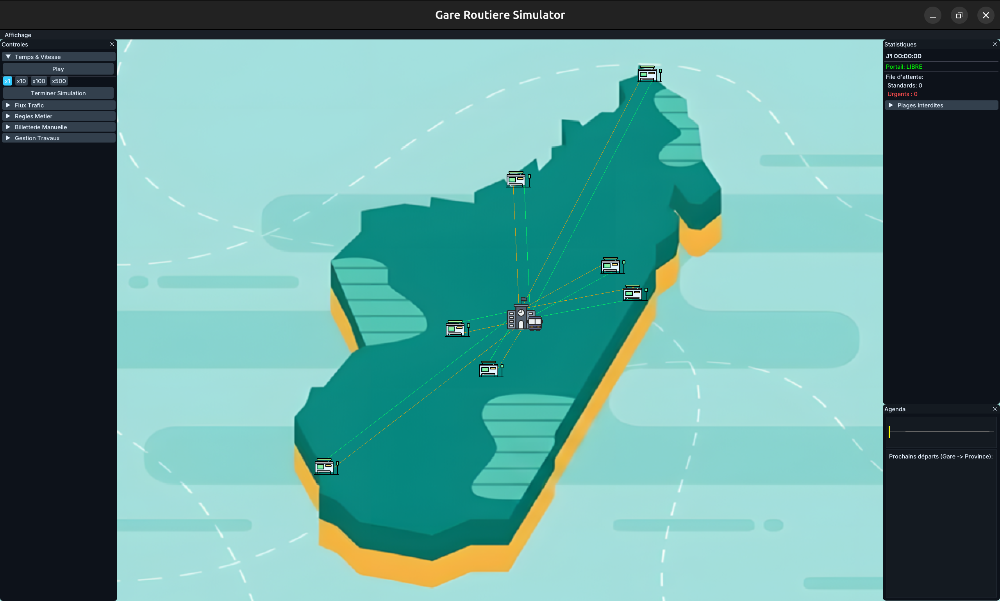
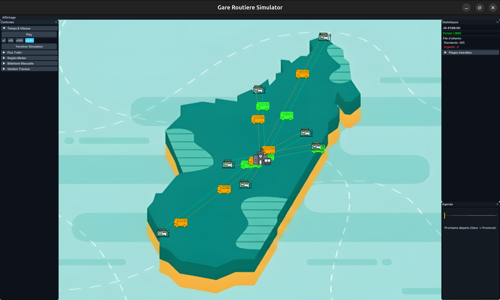
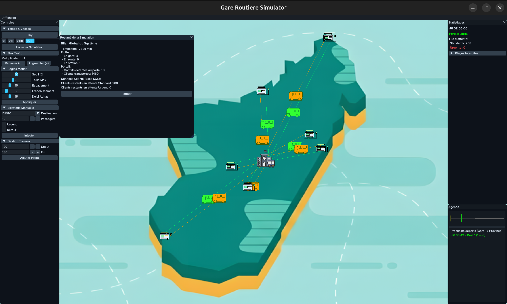

# Oneway
#### Video Demo:  https://youtu.be/v3zfzXAbm_E
#### Description:
A C++17 discrete-event simulation of a bus station in Antananarivo, designed to optimize convoy scheduling, passenger flow, delays, and gateway usage under real-world constraints. Built with CMake, SFML, ImGui, and SQLite.

[](https://isocpp.org/)
[](https://cmake.org/)
[](https://www.kernel.org/)
[](https://www.sfml-dev.org/)
[](https://github.com/ocornut/imgui)
[](https://www.sqlite.org/)
[](#)

## Overview

**Oneway** simulates a single-gateway bus station in Antananarivo, Madagascar. It models convoy scheduling, passenger queues, and gateway constraints for an intercity bus network.

The simulator is meant for testing scheduling rules safely: run scenarios, reserve gateway time slots, and see how decisions affect queues, delays, and fleet usage.

## Context & Problem

In Antananarivo, bus stations are often saturated because each cooperative sets its own departure times independently. With a **single gateway**, inbound and outbound flows block each other, causing long queues, delays, and extra operating costs.

The core question is: **how can convoys be scheduled through a bottleneck while respecting economic, safety, and passenger-satisfaction constraints?**

Software simulation makes it possible to:

- test scenarios without operational risk,
- plan gateway reservations,
- measure the impact of scheduling decisions.

## Project Goals

| # | Goal |
|---|---|
| 1 | Prevent gateway collisions — verified by automated tests |
| 2 | Reduce passenger waiting time |
| 3 | Maximize bus load factor (profitability threshold) |
| 4 | Prioritize urgent passengers (critical deadlines) |
| 5 | Respect forbidden time ranges (night, peak closures) |
| 6 | Maintain long-term stability (return-demand feedback loop) |

Gateway collisions are prevented by combining a physical lock with a gateway reservation schedule. Automated tests check this property when they complete successfully.

## Approach & Core Concepts

The scheduler balances three competing objectives:

- **Profitability** — avoid dispatching nearly empty buses,
- **Passenger satisfaction** — respect patience windows and prioritize emergencies,
- **Physical flow** — prevent overlapping gateway usage.

**Core concepts implemented:**

- discrete-event simulation (1-minute ticks),
- constraint-based scheduling with a temporal gateway schedule,
- priority queue (standard / urgent),
- local optimization guided by a scoring function,
- write-behind persistence (SQLite).

## How It Works

### Simulation Engine

Time advances in **1-minute ticks** (1440 ticks per day). At each tick, the simulator updates state, triggers events, and manages gateway access.

### Execution Cycle

1. Return convoys depart from provinces at their scheduled times.
2. They arrive in the provinces, unload passengers, and generate return requests.
3. At the bus station, new passengers are generated using a **Poisson process**.
4. Every **30 minutes** (by default), the scheduler:
   - consolidates demand,
   - forms convoys,
   - reserves gateway slots on the gateway schedule,
   - optimizes the plan.
5. As soon as a convoy is ready and the gateway is free, it passes through the gateway.

### Ticketing and Urgencies

The queue classifies passengers by patience window. A passenger becomes **urgent** when only **15 minutes** remain (by default) before their deadline. Convoys carrying urgent passengers bypass the profitability threshold and receive priority.

### Gateway Scheduling

The gateway is protected by a reservation schedule: a set of occupied minutes. A slot is granted only if every required minute is free, including a safety margin. The slot is released immediately once the crossing is complete.

## Architecture

The project is split into four independent modules:

- **gare_core** — domain entities (`Voiture`, `Convoi`, `Destination`, etc.)
- **gare_simulateur** — simulation engine, scheduler, ticketing, demand generator
- **gare_db** — SQLite persistence (write-behind)
- **gare_ui** — graphical interface (SFML + ImGui)

This modular layout supports future extensions and a **headless** build (without UI) for automated testing.

```
Data flow:
GenerateurDemandes → Billetterie → Planificateur → Simulateur → SQLite (Write-Behind)
```

## Algorithms

### Scheduling Strategy

The system uses a **centralized scheduler** that reorganizes departures every 30 minutes through a fixed multi-step workflow:

1. **Collect waiting passengers** — the ticketing module reports all waiting passengers by destination, classified as *standard* or *urgent*.
2. **Group requests by destination** — total demand per route is computed to measure line pressure.
3. **Identify available buses** — free buses at the station are selected and sorted by current occupancy to improve load factor.
4. **Build convoys** — buses are grouped into convoys of 1 to 8 vehicles to share gateway crossings. A convoy is created only when justified:
   - global load reaches the profitability threshold (default **50%** of capacity),
   - at least one urgent passenger is onboard,
   - the station faces a shortage (no free buses left) and must repatriate vehicles.
5. **Reserve gateway slots** — each convoy searches for a free slot in the gateway schedule. A slot is accepted only if all required minutes (crossing duration + safety margin) are available and do not fall inside a forbidden range. Lookup uses **O(1)** checks, followed by forward scanning when needed. If no slot is found, the scheduler attempts to **shift** a non-urgent convoy to free space.
6. **Run local optimization** — once all convoys are placed, the scheduler merges nearby convoys, shifts departure times, and removes low-load convoys below the critical threshold (default **20%**). Each change is kept only if it improves the score.
7. **Execute the schedule** — at the scheduled time, the convoy crosses the gateway and the slot is released immediately.

This is a **heuristic local optimization approach**. It does **not** guarantee a globally optimal schedule.

### Global Scoring Function

During local optimization, candidate schedule modifications are evaluated with a scoring function. A change is retained only when it improves the overall plan score.

$$
Score = \alpha \times Passenger
      + \beta \times Convoys
      + \gamma \times AverageDelays
$$

Where:

- **α (alpha)** represents the weight assigned to passenger throughput.
- **β (beta)** represents the weight assigned to the number of convoys.
- **γ (gamma)** represents the weight assigned to average passenger delays.

These coefficients let the scheduler balance the three objectives: moving more passengers, limiting convoy overhead, and reducing waiting time. When comparing two plans, the scheduler keeps the one with the better overall score.

Default weights:

- **α = 10**
- **β = 5**
- **γ = 1**

### Local Optimization Workflow

The full scheduling loop can be summarized as:

1. Collect waiting passengers.
2. Group requests by destination.
3. Identify available buses.
4. Build convoys.
5. Reserve gateway slots.
6. Evaluate the resulting schedule with the scoring function.
7. Apply local modifications such as:
   - merging nearby convoys,
   - shifting departure times,
   - removing inefficient convoys.
8. Recalculate the score.
9. Keep a modification only when it improves the plan.
10. Execute the final schedule.

This avoids exhaustive combinatorial search while still improving the plan step by step.

### Feedback Loop

When a bus arrives in a province, passengers stay for a period ranging from a few hours to two days. They then generate a return request, which re-enters the ticketing queue. This feedback loop regulates fleet movement over time.

### Design Notes

- **O(1) reservation checks** — the gateway schedule is stored as an `unordered_set` of minutes.
- **Absolute urgency priority** — critical deadlines are not traded off against profitability.
- **Score-guided local search** — merges, small time shifts, and removals improve the plan without combinatorial explosion.
- **Write-behind persistence** — database writes are deferred to reduce simulation overhead.

## Configuration

All operational parameters are loaded from CSV files in `requirement/`:

- fleet and vehicle settings,
- destinations and map coordinates,
- profitability thresholds,
- forbidden time ranges.

**Changing city rules or fleet data does not require recompilation.**

Default values include:

| Parameter | Default |
|---|---|
| Default bus capacity | 32 passengers |
| Profitability threshold | 50% |
| Maximum convoy size | 8 |
| Minimum gateway spacing | 15 minutes |
| Planning frequency | every 30 minutes |
| Critical removal threshold | 20% |
| Night closure | 00:00–06:00 |
| Evening closure | 20:00–21:00 |

Fleet size and vehicle assignments are configured through `requirement/voitures.csv`.

## Installation

### Dependencies

- C++17 compiler
- CMake ≥ 3.16
- SQLite3
- SFML 2.x
- ImGui / ImGui-SFML (fetched automatically by CMake)

### Build

```bash
cmake -S . -B build
cmake --build build -j4
./GareRoutiere
```

Run the executable from the project root so relative asset paths resolve correctly.

## Usage

Launch the graphical simulator:

```bash
./GareRoutiere
```

The UI provides:

- simulation play/pause and speed controls (x1, x10, x100, x500),
- live tuning of scheduling rules,
- manual passenger injection,
- forbidden-range management,
- gateway schedule and statistics panels.

Configuration changes can be made by editing CSV files in `requirement/` and restarting the application.

## Results & Performance

In documented test runs over **5 simulated days**, the project reports **zero gateway collisions** under the tested scenarios. This confirms that the gateway lock and reservation schedule work as intended in those runs.

This result applies to the tested simulation conditions and automated validation. It is not a general real-world guarantee.

**Implemented optimizations:**

- constant-time gateway reservation and release,
- write-behind persistence with dirty-bit tracking,
- 60 FPS visual interpolation without increasing simulation cost,
- headless architecture for automated tests.

## Screenshots

### Main Simulation Interface

Initial view at Day 1, 00:00:00 with the Madagascar map, control panels, and the gateway shown as free.



### Active Simulation

Simulation running at x500 speed on Day 4 with convoys in transit, queue counts, and live gateway status.



### Simulation Summary & Live Controls

Simulation paused at x500 with business-rule controls open and the end-of-run summary dialog showing fleet status, zero gateway conflicts, and transported passengers.



## Tests

| Test | Validation |
|---|---|
| **5-day stress test** (`test_stress`) | No collisions, rule compliance, persistence OK |
| **Functional test** (`commit`) | Pause/speed, manual injections, live tuning, forbidden ranges |

Tests run in headless mode:

```bash
cmake --build build -j4
./build/tests/test_stress
./build/tests/commit
```

## Limitations & Future Improvements

- The single gateway remains a physical bottleneck; the software optimizes usage but cannot remove the constraint.
- Possible future work: multi-gateway support, advanced AI (genetic algorithms), demand forecasting with machine learning, data export, and a web interface.

## FAQ

- **Can all gateway collisions be avoided?**  
  In the tested simulation scenarios, automated tests report no collisions when they complete successfully.

- **Why do buses wait even though they could depart?**  
  To respect the profitability threshold or because no urgent demand requires immediate dispatch.

- **Can the simulator be adapted to another city?**  
  Yes. Update the CSV configuration files and the map asset.

## Glossary

| Term | Definition |
|---|---|
| **Tick** | One simulated minute |
| **Gateway schedule** | Set of minutes reserved for gateway crossings |
| **Convoy** | Group of 1 to N buses crossing the gateway together |
| **Urgent** | Passenger who must depart before their deadline |
| **Write-Behind** | Deferred database persistence |

"Thank you so much for checking out my repo. I'm open to all improvements :>"
